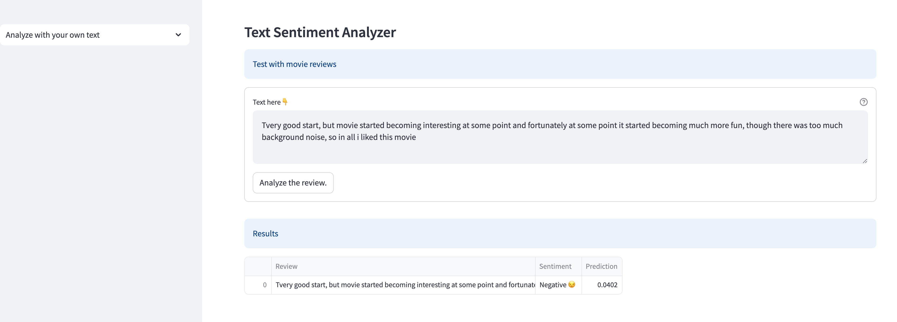

# Sentiment Analysis System

## Project Overview
This is our practice project for a sentiment analysis system. 

The project aims to create a sentiment analysis system that classifies input data into positive or negative sentiment categories. The system is designed to analyze text, and in upcoming phases, images and audio to determine sentiment.

The data distribution focuses on text first. The text data is initially sourced from the IMDB dataset, which contains 50,000 movie reviews labeled as positive or negative. Subsequently, larger datasets from broader domains will be used.

By leveraging deep learning techniques, we compare the performance of different models for sentiment analysis. For text, we primarily use LSTM with pretrained Word2Vec embeddings [Gensim], following trials with various models such as Simple RNN, GRU (both multi-layer and bidirectional), and LSTM (both multi-layer and bidirectional) with pretrained Word2Vec [Gensim]. For image analysis, we use CNN, and for audio analysis, we use LSTM.

The project is built using TensorFlow and Keras, and it includes a Streamlit application for easy demonstration and usage.

## Current Evaluation Metrics

| Models                     | time(seconds) | Evaluation        |              | 
|----------------------------|---------------|-------------------|--------------|
|                            |               | loss              | accuracy     |
| Simple RNN                 | 21            | 0.4795            | 0.7762       |
| <mark style="background-color: yellow;">LSTM</mark> | <mark style="background-color: yellow;">4</mark> | <mark style="background-color: yellow; color: red;">0.5294</mark> | <mark style="background-color: yellow;">0.8840</mark>   |
| GRU                        | 4             | 0.4961            | 0.8283       |
| Pretrained Word2Vec[Gensim]| 3             | 0.3205            | 0.8638       |

Models comparison details can be downloaded [here](application/models/imdb/models_comparation.xlsx)

## Demo

The Streamlit application provides an interactive interface for testing the sentiment analysis system. The application allows users to input text data and view the sentiment analysis results. The application also includes a file uploader for testing the sentiment analysis on custom text files.

This is the negative sentiment analysis case.

## Data Collection

### Text Sentiment Analysis
- **IMDB Dataset**: Contains 50,000 movie reviews labeled as positive or negative. The dataset is used for training the text sentiment analysis model. [Link](https://www.kaggle.com/lakshmi25npathi/imdb-dataset-of-50k-movie-reviews)
- **Google’s Word2Vec Model**: Pre-trained word embeddings from Google’s Word2Vec model, trained on the Google News dataset with 300 dimensions. [Link](https://code.google.com/archive/p/word2vec/)

## Models Architecture

### Text Sentiment Analysis
- **LSTM (Long Short-Term Memory)**: A type of RNN (Recurrent Neural Network) that is capable of learning long-term dependencies. We use LSTM for text sentiment analysis. The model is trained on the IMDB dataset, which contains movie reviews labeled as positive or negative. The LSTM model is trained with different word embeddings: Word2Vec, GloVe (Upcoming), and FastText (Upcoming). The model is evaluated based on accuracy and loss metrics. The best-performing model is selected for integration into the Streamlit application.
- **Word2Vec-Google-News-300**: Utilizes pre-trained word embeddings from Google’s Word2Vec model, which is trained on the Google News dataset with 300 dimensions.

### Image Sentiment Analysis (Upcoming)
- **Pre-trained CNN (Convolutional Neural Network)**: Extracts features from images to classify sentiment.

### Audio Sentiment Analysis (Upcoming)
- **MFCC (Mel-Frequency Cepstral Coefficients)**: Extracts features from audio signals.
- **LSTM**: Analyzes the temporal features extracted from audio data.

## Technology Stack

- **TensorFlow**: An open-source deep learning framework. TensorFlow is used for building and training the deep learning models.
- **Keras**: A high-level neural networks API written in Python, running on top of TensorFlow. Keras is used for building the deep learning models.
- **Google Colab**: Used for building and training the models before integrating them into the Streamlit application.
- **Streamlit**: An open-source app framework for Machine Learning and Data Science projects. Streamlit is used to create an interactive web application for demonstrating the sentiment analysis system.

## How to Run the Application

### File Structure
- **application/main.py**: The main Streamlit application file.
- **application/models**: Contains the trained models for text, image, and audio sentiment analysis.
- **requirements.txt**: List of required Python packages.
- **text_sentiment_colab_notebook.ipynb,sound_sentiment_colab_notebook.ipynb,image_sentiment_colab_notebook.ipynb**: Google Colab notebook for building and training the models.

### Using Google Colab

Steps to Build and Train Models in Google Colab:

1. **Open the Colab Notebook**: Open `application/models/*.ipynb` in Google Colab.
2. **Run the Cells**: Execute the cells in the notebook to build and train the models.
3. **Save the Models**: Save the trained models to your Google Drive or download them to your local machine.
4. **Load the Models in Streamlit**: Move the saved models to your Streamlit project directory and load them in the `model.py` file.

### Running the Streamlit Application

1. **Install Dependencies**: Run `pip install -r requirements.txt` to install the required Python packages.
2. **Start the Application**: Run `streamlit run main.py` in your terminal to start the Streamlit application.
3. **Interact with the Application**: Use the web interface to test the sentiment analysis on text, image, and audio inputs.

## References

### Courses:
- Neural Networks and Deep Learning course by Andrew Ng: [Link](https://www.coursera.org/learn/neural-networks-deep-learning)
- Convolutional Neural Networks course by Andrew Ng: [Link](https://www.coursera.org/learn/convolutional-neural-networks)
- Sequence model course by Andrew Ng: [Link](https://www.coursera.org/learn/nlp-sequence-models)

### Frameworks and Libraries:

- **Streamlit**: [Streamlit Documentation](https://docs.streamlit.io/en/stable/)
- **TensorFlow**: [TensorFlow Documentation](https://www.tensorflow.org/)
- **Keras**: [Keras Documentation](https://keras.io/)
- **Google Colab**: [Google Colab Documentation](https://colab.research.google.com/notebooks/intro.ipynb)
- **IMDB Dataset**: [IMDB Dataset](https://www.kaggle.com/lakshmi25npathi/imdb-dataset-of-50k-movie-reviews)
- **Google’s Word2Vec Model**: [Google’s Word2Vec Model](https://code.google.com/archive/p/word2vec/)
- **Gensim**: [Gensim Documentation](https://radimrehurek.com/gensim/)
- **FastText**: [FastText Documentation](https://fasttext.cc/)
- **GloVe**: [GloVe Documentation](https://nlp.stanford.edu/projects/glove/)
- **MFCC**: [MFCC Documentation](https://en.wikipedia.org/wiki/Mel-frequency_cepstrum)
- **LSTM**: [LSTM Documentation](https://en.wikipedia.org/wiki/Long_short-term_memory)
- **CNN**: [CNN Documentation](https://en.wikipedia.org/wiki/Convolutional_neural_network)
- **RNN**: [RNN Documentation](https://en.wikipedia.org/wiki/Recurrent_neural_network)
- **Word2Vec**: [Word2Vec Documentation](https://en.wikipedia.org/wiki/Word2vec)
- **Google News Dataset**: [Google News Dataset](https://en.wikipedia.org/wiki/Google_News)

## Contributors

- [Loc Tong](loctong@gmail.com)
